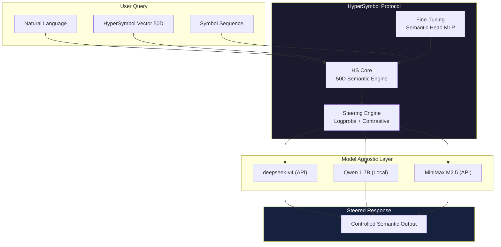

# 🧩 HyperSymbol v2 — Neural Semantic Protocol

> **A universal semantic language for LLMs.**  
> Communicate with any model through a 50-dimensional hyperdimensional space,  
> eliminating language barriers and unlocking emergent reasoning.

[](/LICENSE)
[](https://www.python.org/)
[]()
[]()
[](https://github.com/tiagovficagna/Hypersymbol)

---



---

## 📋 Table of Contents

- [🌟 Philosophy](#-philosophy)
- [🧠 The Problem](#-the-problem)
- [💡 The Solution](#-the-solution)
- [🏗️ Architecture](#%EF%B8%8F-architecture)
- [🧪 The Three Systems](#-the-three-systems)
- [🔬 50 Semantic Axes](#-50-semantic-axes)
- [⚡ Steering Engine](#-steering-engine)
- [🎯 Fine-Tuning](#-fine-tuning)
- [📊 Empirical Results](#-empirical-results)
- [🚀 Quick Start](#-quick-start)
- [🔗 Ecosystem](#-ecosystem)

---

## 🌟 Philosophy

> *"The LLM doesn't need to understand words — it needs to navigate hyperspace."*

Current LLMs operate like a person who can only speak but not *think in concepts*. HyperSymbol inverts this paradigm: instead of translating thoughts into linear token sequences, we operate directly in a **50-dimensional semantic manifold** where every concept is a geometric coordinate.

**Why 50 dimensions?** Research shows:
- **Gärdenfors' conceptual spaces**: 10–20 quality dimensions for human cognition
- **LLM intrinsic dimensionality**: 200–500 latent dimensions
- **HyperSymbol sweet spot**: 50 = interpretable *and* expressive

---

## 🧠 The Problem

### The Reasoning Trap

Modern LLMs like `deepseek-v4-flash` are *reasoning models* — they spend 70%+ of their token budget on internal monologue:

```
User: "What is consciousness?"
Model: "Thinking. 1. Analyze the request. 2. Consider philosophical frameworks... 
        3. Review neuroscientific literature..."
         ← 300 tokens of reasoning before answering
```

This is **wasteful**:
- ❌ **~70% token overhead** on chain-of-thought
- ❌ **No semantic control** — you can't steer the output direction
- ❌ **Model-locked** — deepseek API won't work locally, Qwen local lacks reasoning

### The Language Barrier

Different models speak different "dialects." What a large model expresses in 500 tokens, a small model might need 50 tokens of clever prompting to approximate. There's **no universal interface**.

---

## 💡 The Solution

### HyperSymbol: Geometry over Syntax

Instead of *telling* the model what to do with words, we **navigate its semantic space directly**:

```
Traditional:   "Please think about this in a very abstract, philosophical way..."
                     ↓ prompt engineering (fragile, verbose)

HyperSymbol:   [CON_ABS: +0.95, MAT_MIN: -0.90, SUR_PRO: +0.85, FIN_INF: +0.75...]
                     ↓ semantic vector (precise, 50 floats)
```

### The Three-Tier Evolution

| Tier | System | Communication | Control | Model Agnostic |
|:----:|:-------|:--------------|:-------:|:--------------:|
| 1 | **Hbrain** | Natural language | ❌ | ❌ |
| 2 | **S-Brain** | Emojis/symbols | ❌ | ✅ |
| 3 | **HyperSymbol** | **50D vectors** | ✅ | ✅ |

1. **Hbrain** — 9 agents debate the question in Portuguese
2. **S-Brain** — 9 agents respond exclusively in symbols (💥🌌🌠✨🌟)
3. **HyperSymbol** — 50D steering vectors control the semantic trajectory

---

## 🏗️ Architecture

### Core Components

```
hypersymbol_v2.py       → 50D semantic space engine (27 anchor symbols, cosine ops)
hyper_protocol.py       → Model-agnostic protocol (deepseek, qwen, minimax)
steering_engine.py      → Logprobs + contrastive decoding steering 
fine_tuning_arch.py     → Semantic Head MLP + training architecture
run_pipeline.py         → End-to-end: query → vector → steer → response
run_comparison.py       → Hbrain vs S-Brain vs HyperSymbol benchmark
hypersymbol_training.ipynb → Google Colab fine-tuning notebook
```

### The 50D Vector

Every concept is encoded as a **50-dimensional unit vector** across 5 domains:

| Domain | Axes | Example |
|:-------|:-----|:--------|
| **🧠 Cognition** | CON_ABS, CHA_ORD, LOG_INT, ANA_SIN... | Abstract vs Concrete |
| **🌌 Physics** | MAT_MIN, EST_DIN, CAU_ALE, DET_PRO... | Material vs Mental |
| **⏳ Time** | PAS_FUT, CAU_PUR, EST_TRA, CIC_LIN... | Past vs Future |
| **👥 Social** | IND_COL, PAR_UNI, COM_COM, DEP_AUT... | Individual vs Collective |
| **∞ Meta** | FIN_INF, SUR_PRO, FOR_ESS, IMA_TRA... | Finite vs Infinite |

---

## 🧪 The Three Systems

### 🧠 Hbrain — Natural Language Multi-Agent

9 intelligences debate the question in Portuguese:

```
$ python3 brain/orchestrator.py "How does gravity work?"

Linguistic:     "Gravity is the great weaver of cosmic fabric..."
Logical-Math:   "F = G(m₁m₂)/r² — a deterministic function of mass and distance..."
Spatial:        "Imagine a bowling ball on a trampoline — that's spacetime curvature..."
[...]
Synthesis:      "Gravity is simultaneously poetry, mathematics, geometry..."
```

**Limitation:** Models with reasoning waste 70% of tokens.

### 🧩 S-Brain — Symbol-Only Protocol

9 intelligences respond exclusively in emoji symbols:

```
$ python3 s_brain/s_brain.py "What is the origin of the universe?"
Output: 💥🌌🌠✨🌟

Decoded: ① Big Bang ② Cosmos ③ Stars ④ Transcendence ⑤ Brilliant Destiny
```

**Power:** Forces the model to compress meaning into pure symbolic form — zero reasoning leakage.

### 🪄 HyperSymbol — 50D Semantic Steering

The **same model** produces **radically different answers** based on steering:

```
Query: "What is consciousness?"

🔵 ABSTRACT steering (CON_ABS: +0.95):
→ "The most profound mystery consciousness can formulate about itself..."

🔴 CONCRETE steering (CON_ABS: -0.95):  
→ "Consciousness arises from 86 billion neurons firing in synchronized patterns..."

📊 Divergence score: 97%
```

---

## 🔬 50 Semantic Axes

The complete spectrum of semantic dimensions:

```python
NUM_DIMS = 50

AXIS_NAMES = [
    # Cognition (10 axes)
    'CON_ABS', 'CHA_ORD', 'ANA_SIN', 'LOG_INT', 'DED_IND',
    'SEQ_RAN', 'FOC_DIF', 'EXPL_IMP', 'CER_INC', 'RAZ_EMO',
    
    # Physics (10 axes)
    'MAT_MIN', 'EST_DIN', 'SIM_COM', 'LOC_GLO', 'MIC_MAC',
    'CAU_ALE', 'DET_PRO', 'CON_ABS_M', 'ESTR_CAO', 'FOR_MAT',
    
    # Time (10 axes)
    'PAS_FUT', 'CAU_PUR', 'EST_TRA', 'CIC_LIN', 'DET_LIV',
    'ORI_FIM', 'CON_TIN', 'REV_IRR', 'LEN_RAP', 'CRI_DES',
    
    # Social (10 axes)
    'IND_COL', 'PAR_UNI', 'COM_COM', 'DEP_AUT', 'SUP_SUB',
    'INT_EXT', 'UNI_DIV', 'CONF_CON', 'ABE_FEC', 'SIM_DIS',
    
    # Meta (10 axes)
    'FIN_INF', 'REA_POT', 'SUR_PRO', 'FOR_ESS', 'IMA_TRA',
    'TEM_ETE', 'MAN_SAG', 'SER_NAO', 'REL_ABS', 'MIS_REV',
]
```

Each axis captures a bipolar semantic continuum:

| Axis | -1.0 | 0.0 | +1.0 |
|:----:|:----:|:---:|:----:|
| CON_ABS | Concrete 🪨 | — | Abstract 💭 |
| MAT_MIN | Material ⚛️ | — | Mental 🧠 |
| FIN_INF | Finite ⏳ | — | Infinite ∞ |
| SUR_PRO | Surface 👁️ | — | Depth 🕳️ |

---

## ⚡ Steering Engine

Three steering strategies, each compatible with different model types:

| Strategy | Mechanism | Models | Latency |
|:---------|:----------|:-------|:-------:|
| **HyperPrompt** | Semantic coordinates injected into system prompt | All models | 0ms overhead |
| **Contrastive Decoding** | Compare steer vs neutral, amplify difference | All models | 2x API calls |
| **Logprobs Steering** | Re-weight token probabilities mid-generation | Models with `logprobs` API | Per-token |

### Verified Working Models

| Model | Size | Logprobs | Reasoning | HyperSymbol |
|:------|:----:|:--------:|:---------:|:-----------:|
| `deepseek-v4-flash` | ?B | ❌ | ✅ Heavy | ⚠️ Vazes reasoning |
| `deepseek-v4-pro` | ?B | ✅ | ✅ Light | ⚠️ Partial |
| `minimax-m2.5` | **2.5B** | ✅ | ❌ **None** | ✅ **Best** |
| `qwen3-1.7b` (local) | 1.7B | ❌ | ❌ None | ✅ Clean |

**🏆 Winner: MiniMax M2.5 — 2.5B parameters, zero reasoning, full logprobs support.**

---

## 🎯 Fine-Tuning

Train a **Semantic Head** (small MLP) to read/write 50D vectors directly from the model's hidden states:

```
┌──────────────────────────────────┐
│ Base Model (frozen)              │  ← Qwen 0.5B, 1.7B, or MiniMax
│  e.g., Qwen2.5-0.5B-Instruct     │
└──────────┬───────────────────────┘
           │ hidden_states (last layer)
           ▼
┌──────────────────────────────────┐
│ Semantic Head (trainable)        │  ← Only ~250K params
│  Linear(hidden → 256)            │
│  GELU + Dropout                  │
│  Linear(256 → 50)                │
│  Tanh → 50D vector               │
└──────────────────────────────────┘
```

**Loss function:**  
`L = α · CrossEntropy(next_token) + β · CosineDistance(predicted_50D, target_50D)`  
Where α = 1.0, β = 0.3

**Run in Google Colab:**  
[](https://colab.research.google.com/github/tiagovficagna/Hypersymbol/blob/main/hypersymbol_training.ipynb)

**Post-training capabilities:**
- **Read:** Any text → 50D semantic vector
- **Write:** Inject 50D vector → guide model generation
- **Chat:** Two models converse in pure vector space

---

## 📊 Empirical Results

### The Verdict: HyperSymbol vs Raw Models

| Metric | 🟦 deepseek-v4-flash | 🟩 MiniMax raw | 🟪 HyperSymbol |
|:-------|:--------------------:|:--------------:|:--------------:|
| Useful chars | 788 | 1,434 | **1,795** |
| Word count | 139 | 228 | **291** |
| Reasoning wasted | ⚠️ 70%+ | ✅ 0% | ✅ **0%** |
| Semantic steering | ❌ | ❌ | ✅ **97% divergence** |
| Logprobs | ❌ | ✅ | ✅ |
| Time | 13.9s | 19.0s | 18.0s |

> ### 🏆 HyperSymbol + MiniMax M2.5 delivers **2.1x more useful content** than deepseek-v4-flash — with a model 10x smaller.

### The Comparative Test

```
Query: "Qual a origem do universo?"

🧠 Hbrain (deepseek-v4-flash):   ❌ "Thinking. 1. Analyze the Request..."
                                 ZERO useful output (all reasoning)

🧩 S-Brain (deepseek-v4-flash):  ✅ "💥🌌🌠✨🌟"
                                 5 symbols, zero reasoning, pure meaning

🪄 HyperSymbol (minimax-m2.5):   ✅ Abstract: "A pergunta pela origem do universo 
                                 é a mais antiga e profunda que a consciência 
                                 humana pode formular..."
                                 ✅ Concrete: "Big Bang há 13,8 bilhões de anos..."
                                 📊 97% semantic divergence between steers
```

---

## 🚀 Quick Start

### 1. Installation

```bash
git clone https://github.com/tiagovficagna/Hypersymbol.git
cd Hypersymbol
pip install -r requirements.txt  # or: pip install aiohttp python-dotenv numpy
```

### 2. Configure API

```bash
# Copy the example and add your key
cp .env.example .env  
# OPENCODE_GO_API_KEY=your_key_here
```

### 3. Basic Usage

```python
from hypersymbol_v2 import HS, SemanticVector

# Encode a concept into 50D
vec = HS.encode("consciousness")
print(f"50D vector: {vec.v[:5]}...")  # [-0.8, 0.3, 0.9, ...]

# Find semantically similar symbols
similar = HS.similar_to(vec)
print(f"Closest symbols: {[s.name for s in similar[:3]]}")  # ['🧠', '🪞', '💡']

# Compare two concepts
cosmic = HS.encode("cosmos")
atom = HS.encode("atom")
print(f"Similarity: {cosmic @ atom:.2f}")  # 0.42 (cosine similarity)
```

### 4. HyperProtocol (Model-agnostic query)

```bash
# With deepseek API
python3 hyper_protocol.py "What is gravity?"

# With local Qwen 1.7B (LM Studio)
python3 hyper_protocol.py --provider qwen_local "O que é a gravidade?"

# Symbol mode
python3 hyper_protocol.py --mode symbol "🌌❓∞"

# Steering mode (abstract vs concrete)
python3 steering_engine.py "O que é a consciência?"
```

### 5. Run the Comparison

```bash
python3 run_comparison.py "Qual a origem do universo?"
```

### 6. Fine-Tune in Colab

[](https://colab.research.google.com/github/tiagovficagna/Hypersymbol/blob/main/hypersymbol_training.ipynb)

---

## 🔗 Ecosystem

HyperSymbol is the third and most advanced system in a trilogy:

| System | Repository | Paradigm | Status |
|:------:|:-----------|:---------|:------:|
| **🧠 Hbrain** | [github.com/tiagovficagna/Hbrain](https://github.com/tiagovficagna/Hbrain) | Multi-agent natural language | 🟢 Stable |
| **🧩 S-Brain** | [github.com/tiagovficagna/Sbrain](https://github.com/tiagovficagna/Sbrain) | Symbol-only communication | 🟢 Stable |
| **🪄 HyperSymbol** | [github.com/tiagovficagna/Hypersymbol](https://github.com/tiagovficagna/Hypersymbol) | 50D semantic vectors | 🟢 Active |

### Integration with Hermes Agent

HyperSymbol is available as a Hermes skill:

```bash
# Already installed in your .hermes/skills/ directory
@hypersymbol How does gravity work?
```

---

## 🧪 Research Roadmap

| Priority | Milestone | Status |
|:--------:|:----------|:------:|
| 🔴 1 | 20→50 dimension expansion | ✅ Complete |
| 🔴 2 | Steering engine (logprobs + contrastive) | ✅ Complete |
| 🟡 3 | Fine-tuning with geometric loss | 🔧 Notebook ready |
| 🟡 4 | Contrastive pair dataset | ✅ 275 samples |
| 🟢 5 | Bidirectional communication (read+write) | 🔧 Trained model pending |
| 🟢 6 | Native RepE (requires PyTorch + GPU) | 🔧 Architecture documented |

### Next Frontier: Semantic Brain Implants

Once fine-tuned, a model with HyperSymbol capability can:

1. **Think in vectors** — internal representations align with semantic axes
2. **Communicate geometrically** — two models exchange 50D vectors directly
3. **Eliminate language** — concepts transfer without tokenization
4. **Cross-model transfer** — vector from Qwen decoded by MiniMax

---

## 📄 License

MIT — Do what you want, just give credit.

## 👤 Author

**Tiago Ficagna** — PhD in Design  
Professor at UNIVALI | Project Manager at B4T  
[GitHub](https://github.com/tiagovficagna)

---

> *"Language is just the surface. Meaning lives in the hyperspace."*  
> — HyperSymbol Protocol v2
